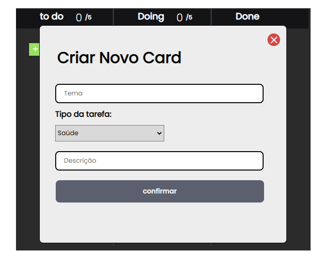
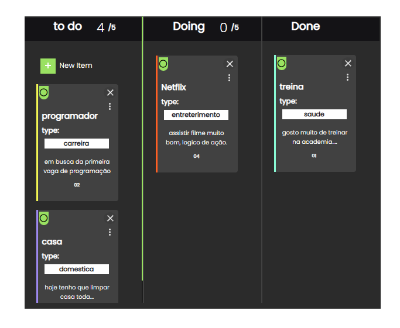

## 💻 projeto em Andamento⏳

Nesse projeto é um App de tarefas, que vc cria uma tarefa dentro do seu "Card", colocando oque vc que fazer no seu dia.
podendo arrantar para opção "doing" e "done" e ate mesmo retornar para o "toDo".

</img>
</img>

## tarefas do projeto

1. Ao clicar no botão new Item deve abrir modal

2.Apos prencher e clicar em confirmar, um card deve aparecer na coluna "To do"

3. Cada card criado terá um indentificador numerico, por ordem crecente. o primeiro card 01, segundo 02...

4. A coluna deve mostrar quantos cards tem nela

5. O maximo derá ser 5 se passa disso o 6 tem que ficar com a cor "RED"..."em andamento"

6. Os cards poderá passar para frente e para atrás

7. No topo terá três pontinhos podendo editar o card "Em andamento"

8. O campo type quando clicado deve apresentar as 4 opções.
. Cada opção adcionada uma cor diferente a borda esquerda do "Card"

## 💻 Tecnologias 

Esse projeto foi desenvolvido com as seguintes tecnologias:

- HTML e CSS
- JavaScript
- Git e Github
- Figma

                    feito por 🙋‍♂️ Caio lima 
